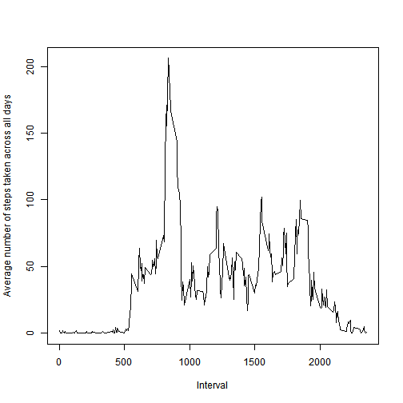

Reproducible Reasech: Peer Assessment 1
========================================


## 1. Loading and preprocessing the data

### * Load the data to a data frame named "activity"


```r
activity <- read.csv(file="activity.csv")
```

### * Process the data


```r
activity$date <- as.Date(activity$date, "%Y-%m-%d")
```


## 2. What is mean total number of steps taken per day?

### * Histogram of the total number of steps taken each day

```r
library(data.table)
# convert the data frame into data table for later calculation
activity.dt <- data.table(activity[!is.na(activity$steps),])
# calculate the total step for each day
activity.dt.stepbyday <- activity.dt[, list(total=sum(steps)), by="date"]
# plot the histogram
hist(activity.dt.stepbyday$total, breaks=20, 
     xlab="Total number of steps taken each day",
     main="")
```

 

### * Calculate and report the mean and median total number of steps taken per day

```r
meanstepbyday <- as.integer(mean(activity.dt.stepbyday$total))
medianstepbyday <- median(activity.dt.stepbyday$total)
```
The mean total number of steps taken per day is 10766.  
The median total number of steps taken per day is 10765.


## 3. What is the average daily activity pattern?

### * Make a time series plot of the 5-minute interval and the average number of steps taken, averaged across all days


```r
# calculate the average steps across all days for each interval
activity.dt.stepbyint <- activity.dt[, list(average=mean(steps)), by="interval"]
# plot the average steps vs interval
plot(activity.dt.stepbyint$interval, activity.dt.stepbyint$average, type="l",
     xlab="Interval", ylab="Average number of steps taken across all days")
```

 

### * Which 5-minute interval, on average across all the days in the dataset, contains the maximum number of steps?


```r
maxint<- activity.dt.stepbyint[which.max(activity.dt.stepbyint$average),]$interval
```

The ***835*** interval is the interval that contains the maximun number of average steps. Average across all the days in the dataset.


## 4. Imputing missing values

### * Calculate and report the total number of missing values in the dataset 

```r
is.missing <- is.na(activity$steps)
sum.missing <- sum(is.missing)
```
The total number of missing values in the dataset is ***2304***.

### * Devise a strategy for filling in all of the missing values in the dataset.
Here I am ssing the mean for that 5-minute interval to fill the missing values.


```r
filling.average <- c()
for (i in seq_along(is.missing)){
  if (is.missing[i]){
    current_interval <- activity[i,]$interval
    current_average <- activity.dt.stepbyint[
      activity.dt.stepbyint$interval==current_interval, ]$average
    filling.average <- c(filling.average, current_average)
  }
}
```

### * Create a new dataset that is equal to the original dataset but with the missing data filled in.

```r
activity.imputed <- activity
activity.imputed[is.missing, ]$steps <- filling.average
```

### * Make a histogram of the total number of steps taken each day 

```r
activity.imputed.dt <-data.table(activity.imputed)
activity.imputed.dt.stepbyday <- activity.imputed.dt[, list(total=sum(steps)),by="date"]
hist(activity.imputed.dt.stepbyday$total,breaks=20,
     xlab="Total number of steps taken each day after imputing missing values",
     main="")
```

 

### * Calculate and report the mean and median total number of steps taken per day. 

```r
meanstepbyday.imp <- as.integer(mean(activity.imputed.dt.stepbyday$total))
medianstepbyday.imp <- as.integer(median(activity.imputed.dt.stepbyday$total))
```

The mean total number of steps taken per day after imputing missing values is ***10766***.  
The median total number of steps taken per day after imputing missing values is ***10766***.


### * Do these values differ from the estimates from the first part of the assignment? 
The mean is same as the estimate from the first part. However, the median increased 1 from the estiamte from the first part.


### * What is the impact of imputing missing data on the estimates of the total daily number of steps?

The imputing of the missing data make the mode of the total daily number of steps have higher frequency.


## 5. Are there differences in activity patterns between weekdays and weekends?

### * Create a new factor variable in the dataset with two levels "weekday" and "weekend"


```r
activity.imputed.dt.pattern <- activity.imputed.dt[, list(steps=steps,
                                                          interval=interval,
                                                          weekday=weekdays(date)
                                                          )
                                                   ]
activity.imputed.dt.pattern$weekday <- as.factor(
  ifelse(activity.imputed.dt.pattern$weekday %in% c("Saturday","Sunday"),
         "Weekend", "Weekday")) 
activity.imputed.dt.pattern <- activity.imputed.dt.pattern[, 
                                                            list(
                                                            average=mean(steps),
                                                            interval=interval,
                                                            weekday=weekday
                                                            ),
                                                            by="interval,weekday"
                                                          ]
```

### * Make a panel plot containing a time series plot of the 5-minute interval (x-axis) and the average number of steps taken, averaged across all weekday days or weekend days (y-axis).

```r
library(ggplot2)
pattern.plot <- qplot(interval, average, data=activity.imputed.dt.pattern, 
           facets=weekday~., geom=c("line")) 
pattern.plot + labs(x="Interval",
                    y="Average number of steps taken across all days")
```

 


